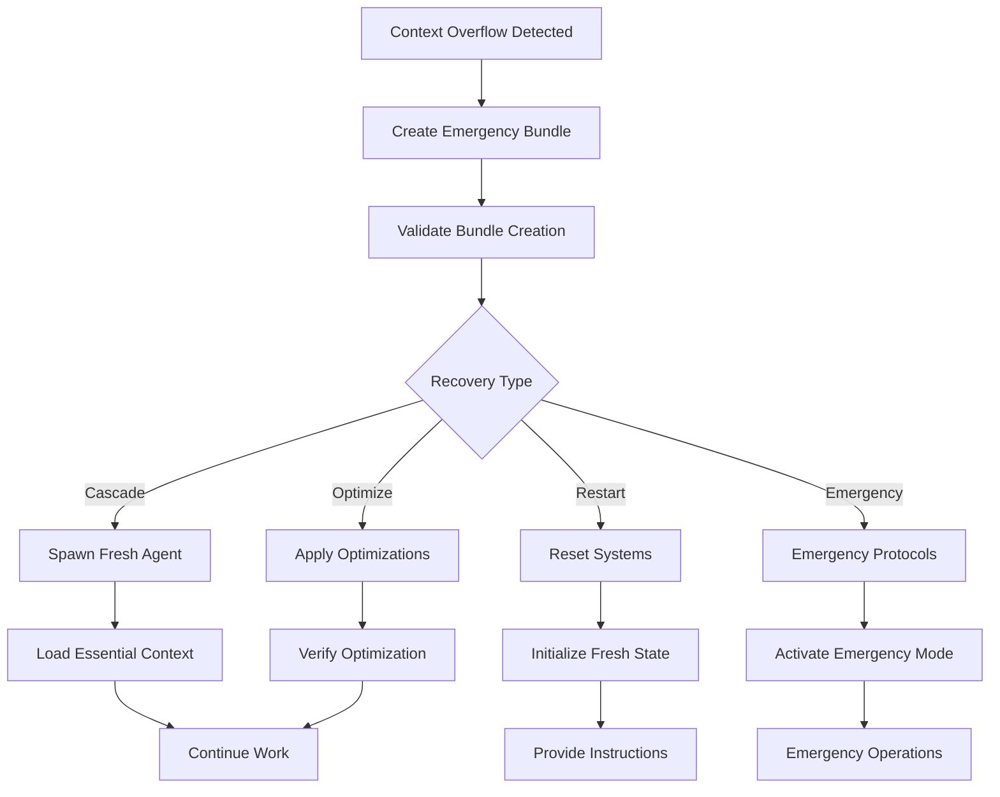

# Emergency Context Recovery

Automatic recovery system for context overflow and performance degradation situations.

## Parameters
- **recovery-type**: Recovery strategy (cascade, optimize, restart, emergency) - default: cascade
- **optimization-level**: Optimization aggressiveness (conservative, balanced, aggressive) - default: balanced

## Recovery Strategies

### Cascade Recovery (default)
Complete context handoff and fresh start:
1. Save current context to emergency handoff bundle
2. Spawn fresh agent with minimal context
3. Load essential context from handoff bundle
4. Continue work with optimized state

### Optimize Recovery  
In-place context optimization:
1. Analyze current context usage
2. Identify optimization opportunities
3. Apply context compression techniques
4. Remove non-essential context data

### Restart Recovery
Clean slate approach:
1. Save complete context handoff bundle
2. Reset all context tracking systems
3. Initialize fresh session state  
4. Provide restoration instructions

### Emergency Recovery
Critical situation handling:
1. Immediate emergency handoff save
2. Force context compaction
3. Terminate non-essential processes
4. Activate emergency protocols

## Execution

### Cascade Recovery Protocol
!`./scripts/handoff-manager.sh emergency ${2:-balanced}`

### Context Analysis and Optimization  
!`./scripts/context-monitor.sh optimize ${1:-cascade}`

### Agent Coordination Recovery
If recovery requires fresh agent spawn:
```
!`claude --model sonnet -p "
<recovery_context>
  Loading from emergency handoff bundle: $EMERGENCY_BUNDLE_ID
  Previous session context: $PREVIOUS_CONTEXT_SUMMARY
  Recovery mode: ${1:-cascade}
</recovery_context>

Continue the work from the handoff bundle with optimized context usage.
" &`
```

## Recovery Triggers

### Automatic Triggers
- Context usage >90% of maximum
- Response time degradation >300%
- Memory pressure indicators
- Tool execution failures
- Session instability detection

### Manual Triggers
- User-initiated recovery command
- Scheduled maintenance recovery
- Pre-emptive optimization
- Development workflow integration

## Optimization Levels

### Conservative
- Preserve maximum context
- Minimal compression
- Safe optimization only
- Prioritize data integrity

### Balanced (default)
- Strategic context reduction
- Intelligent compression
- Pattern-based optimization
- Performance/data balance

### Aggressive  
- Maximum context reduction
- Aggressive compression
- Remove non-critical data
- Prioritize performance

## Recovery Process Flow



## Performance Monitoring

### Recovery Metrics
- Recovery time (target: <30 seconds)
- Context reduction percentage
- Session continuity success rate
- Data preservation ratio
- Performance improvement

### Quality Assurance
- Bundle integrity verification
- Context restoration validation
- Agent coordination verification
- Working state confirmation

## Integration Points

### Context Systems
- **Handoff Manager**: Emergency bundle creation
- **Context Monitor**: Threshold detection and tracking
- **Token Logger**: Usage attribution and analysis
- **Agent Orchestration**: Coordination state management

### Claude Code Integration
- **Hooks System**: Automatic recovery triggers
- **Task Tool**: Fresh agent spawning
- **Settings**: Recovery configuration
- **CLI**: Background recovery processes

## Recovery Scenarios

### Context Overflow
```
🚨 CONTEXT OVERFLOW DETECTED
Current: 185,000 / 200,000 tokens (92.5%)
Triggering cascade recovery...

1. ✅ Emergency bundle created: 20250108_151225_emergency
2. 🔄 Spawning optimized agent...
3. 📥 Loading essential context...
4. ✅ Recovery completed (12.3s)

New context usage: 3,500 tokens (1.75%)
```

### Performance Degradation  
```
⚠️ PERFORMANCE DEGRADATION DETECTED
Response time: 45s (threshold: 15s)
Applying balanced optimization...

• Compressing historical context
• Removing duplicate search results
• Optimizing agent coordination state
• Consolidating tool usage data

✅ Optimization completed
Performance improved by 73%
```

### Memory Pressure
```
🔴 MEMORY PRESSURE CRITICAL
Available: 128MB (threshold: 512MB)
Activating emergency protocols...

• Emergency handoff bundle saved
• Non-essential processes terminated  
• Context compaction applied
• Resource monitoring activated

✅ Emergency recovery successful
Memory usage reduced to 312MB
```

## Error Handling

### Bundle Creation Failures
- Alternative storage locations
- Compressed bundle fallbacks
- Partial context saving
- Critical data preservation

### Agent Spawn Failures
- Alternative model selection
- Reduced context loading
- Manual recovery instructions
- System status reporting

### Context Restoration Failures
- Incremental restoration attempts
- Fallback to minimal context
- Manual intervention options
- Detailed error reporting

## Usage Examples

```bash
# Standard cascade recovery
/recover

# Aggressive optimization
/recover optimize aggressive

# Clean restart with bundle
/recover restart conservative  

# Emergency situation
/recover emergency aggressive

# Custom recovery with specific optimization
/recover cascade balanced
```

## Post-Recovery Actions

### Validation Steps
1. Verify context usage within limits
2. Test agent responsiveness  
3. Confirm task continuity
4. Validate data integrity

### Monitoring Setup
1. Enhanced context monitoring
2. Performance tracking
3. Recovery success metrics
4. Preventive threshold adjustment

### Documentation
1. Recovery event logging
2. Performance impact analysis
3. Context optimization results
4. Lesson learned capture

---

*Emergency recovery system ensuring uninterrupted AWOC operation under all conditions*