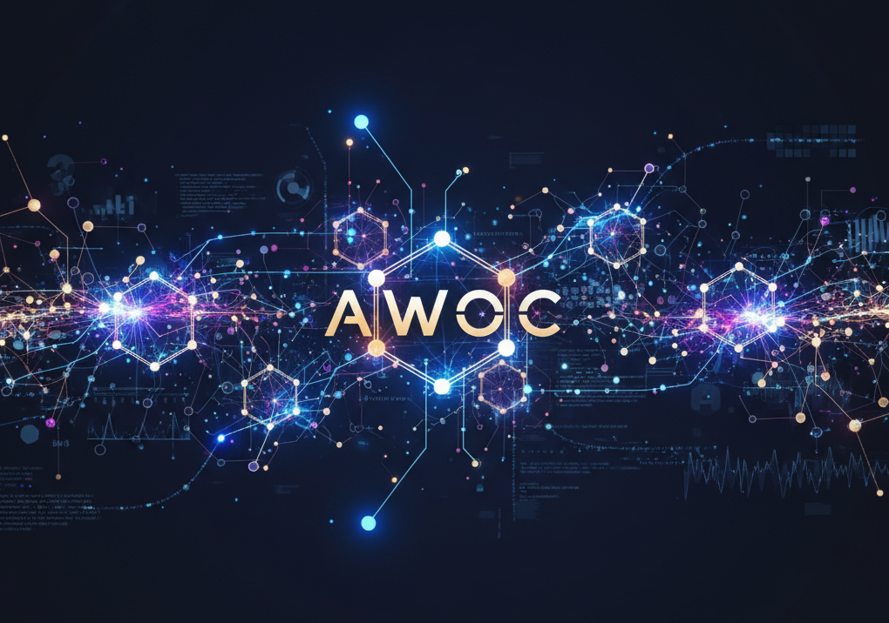

<div align="center">

# AWOC - Agentic Workflows Orchestration Cabinet

**Transform your AI coding assistants into powerhouses of specialized agents, smart workflows, and context-aware orchestration**

[](https://github.com/akougkas/awoc/releases)
[](LICENSE)
[](https://docs.anthropic.com/claude-code)
[](CONTRIBUTING.md)
[](https://github.com/akougkas/awoc/discussions)

[**Quick Start**](#-getting-started) • [**Features**](#-key-features) • [**Community**](#-community--customization) • [**Contributing**](#-contributing) • [**Documentation**](https://github.com/akougkas/awoc/wiki)

</div>

---

> ** New in v2.0**: Smart reinstallation, MCP-ready architecture, community domain packs, 70% token optimization, and the `awoc` CLI is now included in the repo!

AWOC brings enterprise-grade agent orchestration to your favorite AI coding environments. With a simple command, deploy a suite of specialized agents, advanced context management, and intelligent workflows directly into your projects.

## Why AWOC?

AI coding assistants are powerful, but they're general-purpose. AWOC transforms them into specialized, context-aware orchestration systems that:

- **Remember Everything**: Smart context management that maintains state across sessions
- **Work in Teams**: Coordinate multiple specialized agents for complex tasks
- **Learn Your Patterns**: Adaptive workflows that improve with usage
- **Stay Organized**: Project-specific configurations that travel with your code
- **Think Efficiently**: Token optimization that reduces costs by up to 70%

## Key Features

### Multi-Client Architecture
AWOC isn't tied to a single AI platform. Deploy the same powerful orchestration to:
- **Claude Code** (Available Now)
- **Gemini** (Coming Soon)
- **Codex** (Coming Soon)

### Specialized Agent Suite
Six expert agents, each optimized for specific tasks:
- **api-researcher**: Technical documentation and integration specialist
- **content-writer**: Documentation and content creation expert
- **data-analyst**: Data processing and visualization specialist
- **project-manager**: Task breakdown and timeline coordination
- **learning-assistant**: Educational support and concept explanation
- **creative-assistant**: Brainstorming and innovative problem-solving

### Advanced Context Engineering
- **Smart Handoffs**: Seamlessly transfer work between sessions
- **Token Optimization**: Reduce context usage by 70% with intelligent priming
- **Pattern Learning**: ML-powered optimization that adapts to your workflow
- **Session Recovery**: Never lose work with automatic state preservation

## Installation

AWOC installs cleanly in your user space - no sudo required, no system files modified.

### Quick Install

```bash
curl -fsSL https://github.com/akougkas/awoc/raw/main/install.sh | bash
```

This installs:
- `~/.local/bin/awoc` - The AWOC command
- `~/.config/awoc/` - Resources and configuration

### Manual Install

```bash
git clone https://github.com/akougkas/awoc
cd awoc
./install.sh
```

## Getting Started

### 1. Create a New Project

```bash
mkdir ~/projects/my-app
cd ~/projects/my-app
```

### 2. Deploy AWOC to Your Project

```bash
# For Claude Code
awoc install -c claude -d .

# Future support
# awoc install -c gemini -d .
# awoc install -c codex -d .
```

This creates a clean project structure:
```
my-app/
└── .claude/
    ├── agents/       # Specialized agents
    ├── commands/     # Custom commands
    ├── scripts/      # Automation scripts
    └── settings.json # Project configuration
```

### 3. Open Your AI Assistant

Open Claude Code (or supported client) in your project directory. Your enhanced capabilities are ready!

### 4. Use Your New Powers

```bash
# In Claude Code
/awoc-help              # See all capabilities
/session-start          # Initialize smart session
/context-optimize       # Optimize token usage
/delegate              # Coordinate multiple agents
```

## Project-First Philosophy

AWOC believes in project-specific configurations:

```bash
# Install to individual projects (recommended)
cd ~/projects/web-app
awoc install -c claude -d .

cd ~/projects/data-pipeline
awoc install -c claude -d .

# Each project gets its own configuration
# Version control friendly
# No global interference
```

### Global Installation (Use Sparingly)

```bash
# Install to home directory (affects all projects)
awoc install -c claude -d ~/

# ⚠️ You'll see a warning - global installation should be minimal
```

## Commands

```bash
awoc install -c <client> -d <dir>   # Deploy to project
awoc install -d <dir> -f             # Force reinstall with latest fixes
awoc uninstall -d <dir>              # Remove from project
awoc validate -d <dir>               # Check installation
awoc restore -d <dir>                # Restore from backup
awoc list                            # Show available agents
awoc update                          # Update to latest version
awoc doctor                          # Diagnose issues
```

### Supported Clients
- `-c claude` - Claude Code ✅ Available
- `-c gemini` - Gemini (Coming Soon)
- `-c codex` - Codex (Coming Soon)

### Smart Reinstallation
AWOC automatically detects existing installations and updates them intelligently:
```bash
# Regular reinstall (auto-updates configuration)
awoc install -d .

# Force reinstall (replaces all settings)
awoc install -d . -f
```

## Smart Workflows

AWOC enables sophisticated multi-agent orchestration:

### Parallel Research
```yaml
Agents work simultaneously:
- api-researcher: "Find authentication patterns"
- data-analyst: "Analyze usage statistics"
- content-writer: "Draft documentation"
All results synthesized automatically
```

### Context Handoffs
```yaml
Morning session:
- Complete feature implementation
- Save context with /handoff-save

Evening session:
- Load context with /handoff-load
- Continue exactly where you left off
```

### Adaptive Learning
```yaml
AWOC learns from your patterns:
- Frequently used commands
- Common agent combinations
- Optimization opportunities
Automatically suggests improvements
```

## Architecture

AWOC uses a clean, modular design:

```
~/.local/bin/          # User binaries
└── awoc              # CLI tool

~/.config/awoc/        # AWOC configuration
├── resources/        # Agents, commands, scripts
├── backups/          # Automatic backups
└── config.json       # Global settings

~/projects/my-app/     # Your project
└── .claude/          # Project-specific AWOC
    ├── agents/
    ├── commands/
    └── settings.json
```

## Safety & Control

- **Automatic Backups**: Every change is backed up
- **Easy Restoration**: `awoc restore -d .` to rollback
- **Non-Invasive**: No system files modified
- **Complete Removal**: `rm -rf ~/.config/awoc ~/.local/bin/awoc`
- **Project Isolation**: Each project is independent

## Roadmap

### Available Now
- ✅ Claude Code integration
- ✅ 6 specialized agents
- ✅ Smart context management
- ✅ Project-specific deployment
- ✅ Automatic backups

### Coming Soon
- 🔄 Gemini support
- 🔄 Codex support
- 🔄 Custom agent builder
- 🔄 Cloud sync
- 🔄 Team sharing

## Community & Customization

### Your Domain, Your Agents

AWOC is designed to be **extended and customized** for your specific needs. Start with our foundation and build your perfect AI assistant configuration:

#### 🧬 For Scientists
```bash
# Create domain-specific agents
awoc generate-agent --name "lab-assistant" --domain "biology"
awoc generate-agent --name "data-analyzer" --domain "genomics"

# Share with the community
awoc export --domain "science" > my-science-pack.json
```

#### 🎨 For Creators
```bash
# Customize for creative workflows
awoc generate-agent --name "story-architect" --domain "writing"
awoc generate-agent --name "art-director" --domain "design"
```

#### 🏗️ For Engineers
```bash
# Build specialized tooling
awoc generate-agent --name "system-architect" --domain "devops"
awoc generate-agent --name "security-auditor" --domain "security"
```

### Share Your Success

Built something amazing? Your customizations could help thousands:

1. **Domain Packs**: Share agent configurations for specific fields
2. **Custom Commands**: Contribute powerful workflows you've developed
3. **Integration Templates**: Connect AWOC with your favorite tools
4. **Language Support**: Add agents for new programming languages

### Community Showcase

**Current Domain Packs:**
- 📝 **`domains/writing/`** - Content creation and editing tools
- 💻 **`domains/coding/`** - Advanced programming workflows

**Community Contributions (Coming Soon):**
| Domain | Contributor | Description |
|--------|------------|-------------|
| **Data Science** | *You?* | ML pipelines, Jupyter integration |
| **Biology** | *You?* | Lab workflows, paper writing |
| **Finance** | *You?* | Trading bots, risk analysis |
| **Education** | *You?* | Course creation, tutoring |
| **Game Dev** | *You?* | Unity/Unreal specialized agents |

*Be the first to contribute your domain pack!*

## Building on AWOC

### Quick Customization Guide

1. **Start with AWOC**
   ```bash
   awoc install -d ~/my-custom-project
   cd ~/my-custom-project/.claude
   ```

2. **Customize Agents**
   ```bash
   # Copy and modify existing agents
   cp agents/api-researcher.md agents/my-custom-agent.md
   # Edit to add your domain expertise
   ```

3. **Create Custom Commands**
   ```bash
   # Add new commands for your workflow
   echo "Your command logic" > commands/my-workflow.md
   ```

4. **Test Your Customizations**
   ```bash
   awoc validate -d .
   # Open Claude Code and test your new capabilities
   ```

5. **Share with Community**
   ```bash
   # Create your domain pack
   mkdir -p domains/your-field
   cp .claude/agents/* domains/your-field/
   cp .claude/commands/* domains/your-field/

   # Submit a PR
   git checkout -b domain/your-field
   git add domains/your-field
   git commit -m "feat: Add domain pack for [your field]"
   git push origin domain/your-field
   ```

### MCP Integration (Model Context Protocol)

AWOC is **MCP-ready** for next-generation integrations:

```yaml
Future MCP Servers:
- awoc-context: Full project awareness
- awoc-memory: Persistent session memory
- awoc-templates: Domain template server
- awoc-orchestrator: Multi-agent coordination
```

Connect AWOC with MCP servers for enhanced capabilities:
```bash
# Coming soon
awoc mcp add context7        # Real-time documentation
awoc mcp add claude-context  # Codebase search
awoc mcp add your-server     # Your custom MCP server
```

## Contributing
AWOC thrives on community contributions! We especially welcome:
- [Contribution Guide](CONTRIBUTING.md)
  
### Priority Contributions
- **Domain-Specific Agent Packs**: Biology, Finance, Education, Art, Music
- **Tool Integrations**: Jupyter, Docker, Kubernetes, AWS, Azure
- **Language Support**: Python specialists, Rust experts, Go gurus
- **Documentation**: Tutorials, videos, blog posts about your AWOC setup

### How to Contribute

1. **Fork & Branch**
   ```bash
   git fork https://github.com/akougkas/awoc
   git checkout -b feature/your-feature
   ```

2. **Develop & Test**
   ```bash
   # Make your changes
   awoc validate  # Test thoroughly
   ```

3. **Document**
   - Add examples to README
   - Update FEATURES.md if adding capabilities
   - Create AGENTS.md for complex features

4. **Submit PR**
   - Clear description of what you built
   - Examples of how to use it
   - Any special setup required

### Contribution Ideas

#### Starter Projects (Good First Issues)
- Add a new output style template
- Create a domain-specific agent (pick your expertise!)
- Write a tutorial for your use case
- Translate documentation to your language

#### Advanced Projects
- Implement agent memory systems
- Build multi-agent orchestration protocols
- Create visual progress bar formutli-agent builders
- Develop agent performance analytics


## 📄 License

MIT License - see [LICENSE](LICENSE)

## 🙏 Credits

Created by **Anthony Kougkas** with contributions from the amazing AWOC community.

Special thanks to:
- The Claude Code team at Anthropic for the incredible platform
- Early adopters who provided invaluable feedback
- Domain experts sharing their specialized configurations
- Everyone who's starred, forked, or contributed to AWOC

### Stay Updated

- ⭐ **Star this repo** to stay updated with new features
- 👀 **Watch releases** for version announcements

---

<div align="center">

**Ready to amplify your AI coding experience?**

```bash
# Install AWOC in 30 seconds
curl -fsSL https://github.com/akougkas/awoc/raw/main/install.sh | bash

# Deploy to your project
cd ~/projects/my-app
awoc install -d .

# Start building with superpowers 🚀
```

<br>

**AWOC 2.0** - Where AI meets domain expertise

*Built by developers, for developers, with ❤️*

[Get Started](#-getting-started) • [Contribute](#-contributing)

</div>
